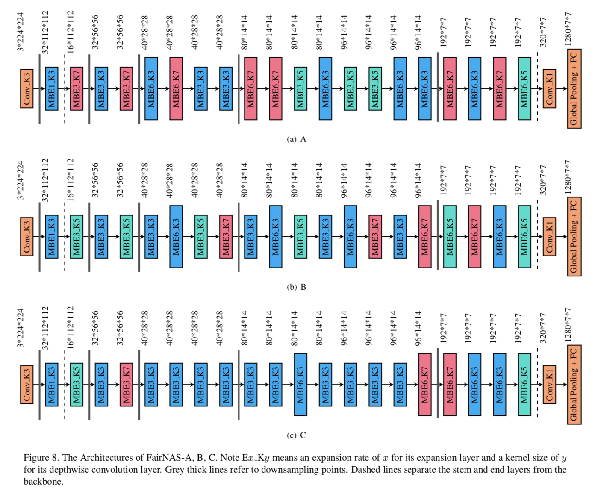
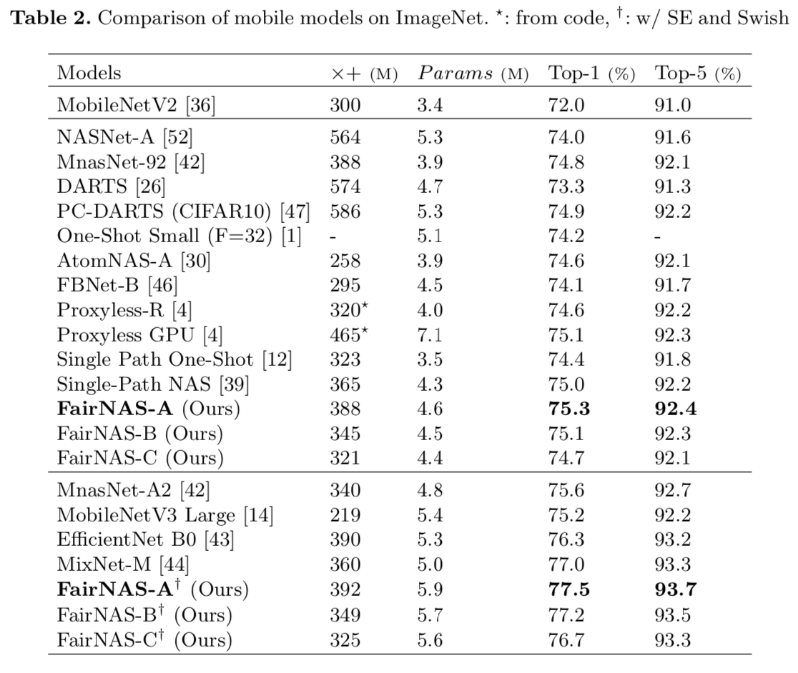

# FairNAS: Rethinking Evaluation Fairness of Weight Sharing Neural Architecture Search


## Introduction

we propose a novel idea called Fair Neural Architecture Search (FairNAS), in which a strict fairness constraint is enforced for fair inheritance and training. In this way, our supernet exhibits nice convergence and very high training accuracy. The performance of any sampled model loaded with shared weights from the supernet strongly correlates with that of stand-alone counterpart when trained fully. This result dramatically improves the searching efficiency, with a multi-objective reinforced evolutionary search backend, our pipeline generated a new set of state-of-the-art architectures on ImageNet: FairNAS-A attains 75.34% top-1 validation accuracy on ImageNet, FairNAS-B 75.10%, FairNAS-C 74.69%, even with lower multi-adds and/or fewer number of parameters compared with others.

The architectures of FairNAS-A,B,C are drawn below. 



## Requirements
* Python 3.6 +
* Pytorch 1.0.1 +


## Updates
* Jul-3-2019： Model release of FairNAS-A, FairNAS-B, FairNAS-C.

## Performance Result


## Preprocessing
We have reorganized all validation images of the ILSVRC2012 ImageNet by their classes.

1. Download ILSVRC2012 ImageNet dataset.

2. Change to ILSVRC2012 directory and run the preprocessing script with
    ```
     ./preprocess_val_dataset.sh
    ```

## Evaluate

To evaluate,
    
    python3 verify.py --model [FairNAS_A|FairNAS_B|FairNAS_C] --device [cuda|cpu] --val-dataset-root [ILSVRC2012 root path] --pretrained-path [pretrained model path]
    

## Citation

Your kind citations are welcomed!

    @article{chu2019fairnas,
        title={FairNAS: Rethinking Evaluation Fairness of Weight Sharing Neural Architecture Search},
        author={Chu, Xiangxiang and Zhang, Bo and Xu, Ruijun and Li, Jixiang},
        journal={arXiv preprint arXiv:1907.01845},
        url={https://arxiv.org/pdf/1907.01845.pdf},
        year={2019}
    }